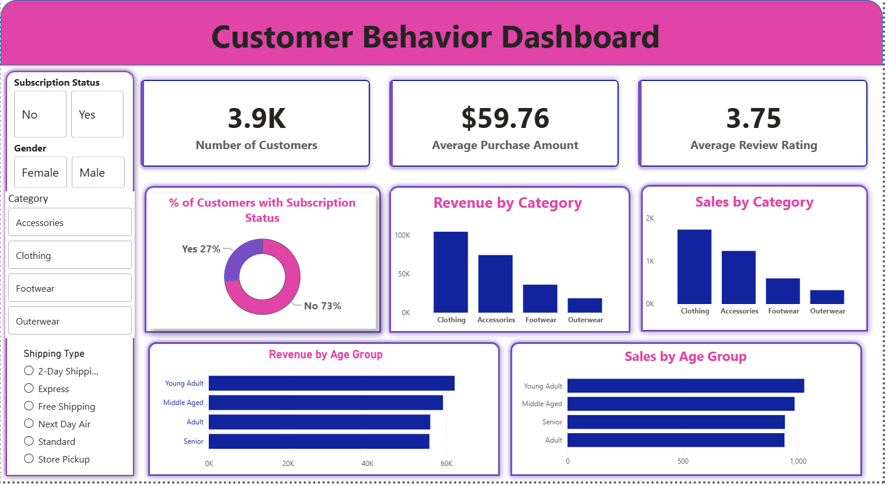
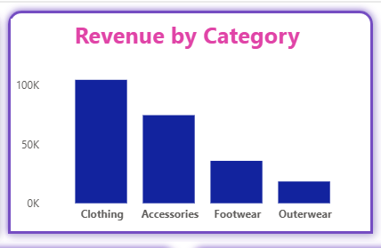
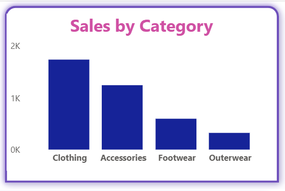
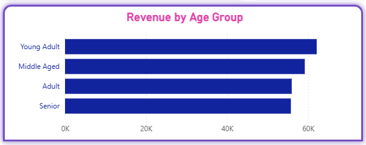
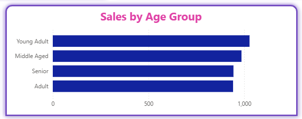
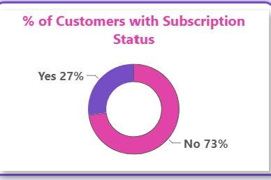

# 🛍️ Retail Customer Shopping Behavior Analysis

<p align="center">


</p>

<p align="center">
A complete end-to-end Data Analytics project using <b>Python</b>, <b>PostgreSQL</b>, and <b>Power BI</b> to analyze retail customer shopping behavior and generate actionable business insights.
</p>

---

# 📑 Table of Contents

- [Project Overview](#-project-overview)
- [Business Problem](#-business-problem)
- [Project Objectives](#-project-objectives)
- [Dataset Information](#-dataset-information)
- [Tech Stack](#-tech-stack)
- [Project Workflow](#-project-workflow)
- [Exploratory Data Analysis](#-exploratory-data-analysis-eda)
- [SQL Business Analysis](#-sql-business-analysis)
- [Power BI Dashboard](#-power-bi-dashboard)
- [Dashboard Preview](#-dashboard-preview)
- [Key Business Insights](#-key-business-insights)
- [Business Recommendations](#-business-recommendations)
- [Project Structure](#-project-structure)
- [Installation & Usage](#-installation--usage)
- [Skills Demonstrated](#-skills-demonstrated)
- [Future Improvements](#-future-improvements)
- [Author](#-author)

---

# 📌 Project Overview

Retail companies generate large volumes of customer transaction data every day. Analyzing this data helps businesses understand customer purchasing behavior, identify sales trends, optimize marketing campaigns, and improve customer satisfaction.

This project performs an end-to-end analysis of a retail customer shopping dataset using **Python**, **PostgreSQL**, and **Power BI**.

The project follows the complete Data Analytics workflow:

- 📥 Data Collection
- 🧹 Data Cleaning
- 📊 Exploratory Data Analysis
- 🗄 SQL Business Analysis
- 📈 Interactive Dashboard Development
- 💡 Business Insights
- 📑 Business Recommendations

The final outcome is an interactive Power BI dashboard that enables stakeholders to make informed, data-driven decisions.

---

# 🎯 Business Problem

A leading retail company wants to better understand its customers' shopping behavior to improve sales performance, customer satisfaction, and long-term customer loyalty.

The management team observed changes in purchasing patterns across different customer demographics, product categories, subscription plans, shipping methods, and promotional offers.

The company wants answers to the following business questions:

- Which customer segments generate the highest revenue?
- Which products are most popular?
- Which product categories perform best?
- Are discounts increasing revenue?
- Which age groups contribute the highest sales?
- Do subscription members spend more?
- Which products receive the highest customer ratings?

The insights obtained from this analysis can help optimize marketing strategies, improve customer engagement, and maximize business profitability.

---

# 🎯 Project Objectives

The primary objectives of this project are:

- Clean and preprocess customer shopping data.
- Handle missing values and improve data quality.
- Perform exploratory data analysis using Python.
- Store the cleaned dataset in PostgreSQL.
- Solve real-world business problems using SQL.
- Develop an interactive Power BI dashboard.
- Generate business insights from the analysis.
- Recommend strategies to improve business performance.

---

# 📂 Dataset Information

| Attribute | Details |
|-----------|---------|
| Dataset Name | Customer Shopping Behavior Dataset |
| File Format | CSV |
| Total Records | **3,900** |
| Total Features | **18 Columns** |
| Missing Values | 37 (Review Rating) |

## Dataset Features

### 👤 Customer Information

- Customer ID
- Age
- Gender
- Location
- Subscription Status

### 🛒 Purchase Information

- Item Purchased
- Category
- Purchase Amount (USD)
- Season
- Size
- Color

### 📦 Shopping Behavior

- Discount Applied
- Previous Purchases
- Review Rating
- Shipping Type
- Payment Method
- Frequency of Purchases

---

# 🛠 Tech Stack

## Programming Language

- Python

## Python Libraries

- Pandas
- NumPy
- Matplotlib
- Seaborn

## Database

- PostgreSQL

## Business Intelligence

- Power BI Desktop

## Presentation

- Gamma AI

## Version Control

- Git
- GitHub

---

# 🔄 Project Workflow

```text
Customer Shopping Dataset
          │
          ▼
Data Cleaning (Python)
          │
          ▼
Exploratory Data Analysis (EDA)
          │
          ▼
Feature Engineering
          │
          ▼
PostgreSQL Database
          │
          ▼
SQL Business Analysis
          │
          ▼
Power BI Dashboard
          │
          ▼
Business Insights & Recommendations
```

# 🧹 Data Cleaning & Preprocessing

The dataset was cleaned and transformed before analysis.

The following preprocessing steps were performed:

- Imported the dataset using Pandas.
- Checked dataset information using `info()`.
- Generated descriptive statistics using `describe()`.
- Identified missing values.
- Filled missing Review Rating values using the median rating of each product category.
- Converted column names into snake_case format.
- Verified data consistency.
- Removed redundant columns.
- Exported the cleaned dataset to PostgreSQL.

---

# 📊 Exploratory Data Analysis (EDA)

Python was used to explore customer shopping behavior and purchasing trends.

The analysis included:

- Customer age distribution
- Gender distribution
- Product category analysis
- Revenue analysis
- Purchase frequency
- Discount usage
- Subscription analysis
- Review rating analysis
- Seasonal purchase trends
- Shipping preference analysis

Several visualizations were created using **Matplotlib** and **Seaborn** to better understand customer behavior.

---
# 💻 SQL Business Analysis

After cleaning the dataset in Python, the processed data was imported into **PostgreSQL** to perform business-oriented analysis. SQL queries were written to answer key business questions and uncover actionable insights.

### Business Questions Solved

#### 1. Revenue by Gender
- Compared total revenue generated by male and female customers.
- Identified the customer group contributing the highest sales.

---

#### 2. High-Spending Discount Users
- Identified customers who:
  - Used discounts
  - Spent more than the average purchase amount
- Helped evaluate the effectiveness of promotional campaigns.

---

#### 3. Top Rated Products
- Calculated the average review rating for each product.
- Ranked products based on customer satisfaction.

---

#### 4. Shipping Type Analysis
- Compared average purchase amounts across different shipping methods.
- Evaluated customer preferences for shipping options.

---

#### 5. Subscriber vs Non-Subscriber Analysis
- Compared:
  - Average Purchase Amount
  - Total Revenue
  - Customer Count
- Determined the business value of subscription members.

---

#### 6. Discount Dependent Products
- Identified products purchased most frequently with discounts.
- Helped understand discount dependency across categories.

---

#### 7. Customer Segmentation
Customers were classified into:

- 🟢 New Customers
- 🔵 Returning Customers
- 🟡 Loyal Customers

based on their purchase history.

---

#### 8. Top Products by Category
Identified the top-performing products within each category based on purchase frequency.

---

#### 9. Repeat Buyer Analysis
Analyzed whether customers with more than five purchases were more likely to subscribe.

---

#### 10. Revenue by Age Group
Calculated revenue contribution across different age groups to identify the highest-value customer segment.

---

# 📊 Power BI Dashboard

A fully interactive dashboard was created using **Microsoft Power BI** to visualize customer behavior and business performance.

### Dashboard Features

### KPI Cards

- Total Customers
- Average Purchase Amount
- Average Review Rating

---

### Revenue Analysis

- Revenue by Product Category
- Revenue by Age Group

---

### Sales Analysis

- Sales by Product Category
- Sales by Age Group

---

### Customer Analysis

- Subscription Distribution
- Customer Segmentation
- Purchase Behaviour

---

### Interactive Filters

Users can filter dashboard results by:

- Gender
- Product Category
- Subscription Status
- Shipping Type

---

# 📷 Dashboard Preview

## 🖥 Customer Shopping Behavior Dashboard

<p align="center">
  
</p>

---

## 📈 Revenue & Sales Analysis

<p align="center">
  
  
</p>

---

## 👥 Age Group Analysis

<p align="center">
  
  
</p>

---

## 💳 Subscription Distribution

<p align="center">
  
</p>

# 📈 Key Business Insights

The analysis revealed several meaningful business insights:

### 💰 Revenue Performance

- Clothing generated the highest overall revenue.
- Young Adult customers contributed the largest share of total revenue.
- Male customers generated slightly higher revenue than female customers.

---

### 🛒 Customer Purchasing Behaviour

- High-spending customers frequently used discounts.
- A significant number of purchases occurred without subscription membership.
- Repeat customers contributed a major share of business revenue.

---

### ⭐ Product Performance

- Gloves, Sandals, and Boots received the highest average customer ratings.
- Some products showed strong dependence on discounts, indicating opportunities to optimize pricing strategies.

---

### 👥 Customer Demographics

- Young Adult and Middle-aged customers represented the highest-value customer groups.
- Subscription members contributed significant revenue despite representing a smaller portion of the customer base.

---

# 💡 Business Recommendations

Based on the analysis, the following recommendations are proposed:

### 🎯 Increase Customer Retention

- Introduce exclusive benefits for subscription members.
- Offer personalized discounts to loyal customers.

---

### 💳 Strengthen Loyalty Programs

- Reward repeat customers with loyalty points.
- Encourage repeat purchases using targeted promotions.

---

### 🛍 Optimize Product Strategy

- Promote top-rated products in marketing campaigns.
- Increase visibility of high-performing product categories.

---

### 💸 Improve Discount Strategy

- Reduce discounts on products with consistently high demand.
- Use personalized discount campaigns instead of broad promotions.

---

### 📢 Targeted Marketing

Focus marketing campaigns on:

- Young Adult customers
- Middle-aged customers
- High-spending customers
- Subscription members

---

### 📊 Business Intelligence

Continue monitoring customer behavior using Power BI dashboards to support data-driven decision making.

---
# 📁 Project Structure

```text
Retail-Customer-Shopping-Behavior-Analysis/
│
├── Dataset/
│   └── customer_shopping_behavior.csv
│
├── Python/
│   └── customer_shopping_behavior_analysis.ipynb
│
├── SQL/
│   └── customer_shopping_behavior_analysis.sql
│
├── PowerBI/
│   └── customer_shopping_behavior_dashboard.pbix
│
├── Report/
│   └── customer_shopping_behavior_report.pdf
│
├── Presentation/
│   └── customer_shopping_behavior_presentation.pptx
│
├── Images/
│   ├── customer_shopping_behavior_dashboard.png
│   ├── revenue_by_category.png
│   ├── sales_by_category.png
│   ├── revenue_by_age_group.png
│   ├── sales_by_age_group.png
│   └── subscription_distribution.png
│
├── README.md
├── requirements.txt
├── LICENSE
└── .gitignore
```

---

# ⚙️ Installation & Usage

## 1️⃣ Clone the Repository

```bash
git clone https://github.com/AnkushSharma5/retail-customer-shopping-behavior-analysis.git
```

---

## 2️⃣ Navigate to the Project

```bash
cd retail-customer-shopping-behavior-analysis
```

---

## 3️⃣ Install Required Libraries

```bash
pip install pandas numpy matplotlib seaborn psycopg2
```

Or install from the requirements file:

```bash
pip install -r requirements.txt
```

---

## 4️⃣ Run the Jupyter Notebook

```bash
jupyter notebook
```

Open:

```
customer_shopping_behavior_analysis.ipynb
```

---

## 5️⃣ Execute SQL Queries

- Import the cleaned dataset into PostgreSQL.
- Open the SQL file from the `SQL/` folder.
- Execute each query to reproduce the business analysis.

---

## 6️⃣ Open the Power BI Dashboard

Open the following file using **Microsoft Power BI Desktop**:

```
PowerBI/customer_shopping_behavior_dashboard.pbix
```

---

# 📊 Project Workflow Summary

```text
Customer Shopping Dataset
          │
          ▼
 Data Cleaning (Python)
          │
          ▼
 Exploratory Data Analysis
          │
          ▼
 Feature Engineering
          │
          ▼
 PostgreSQL Database
          │
          ▼
 SQL Business Analysis
          │
          ▼
 Power BI Dashboard
          │
          ▼
 Business Insights
          │
          ▼
 Recommendations
```

---

# 🎯 Skills Demonstrated

### Programming

- Python
- SQL

### Data Analysis

- Data Cleaning
- Data Preprocessing
- Exploratory Data Analysis (EDA)
- Feature Engineering
- Data Visualization

### Database

- PostgreSQL
- SQL Query Optimization
- Aggregation
- Joins
- Window Functions

### Business Intelligence

- Power BI
- Dashboard Design
- KPI Development
- Interactive Reporting

### Professional Skills

- Business Analysis
- Data Storytelling
- Report Writing
- Presentation Skills
- Git & GitHub

---

# 🚀 Future Enhancements

Future improvements that can enhance this project include:

- Build a Customer Segmentation model using Machine Learning.
- Develop a Product Recommendation System.
- Predict customer purchase behavior.
- Create a Sales Forecasting model.
- Deploy dashboards using Power BI Service.
- Automate the ETL pipeline.
- Integrate real-time retail transaction data.
- Build an interactive web application using Streamlit.

---

# 🏆 Project Outcomes

This project demonstrates an end-to-end Data Analytics workflow and showcases the ability to:

- Collect and preprocess raw business data.
- Analyze customer purchasing behavior.
- Solve business problems using SQL.
- Develop interactive dashboards in Power BI.
- Generate actionable business insights.
- Present findings through professional reports and presentations.

---

# 🤝 Contributing

Contributions are welcome!

If you have suggestions for improving this project:

1. Fork the repository.
2. Create a new feature branch.
3. Commit your changes.
4. Submit a Pull Request.

---

# 📜 License

This project is licensed under the **MIT License**.

See the `LICENSE` file for more details.

---

# 👨‍💻 Author

## Ankush Sharma

**Computer Science & Engineering Student**

Nitte Meenakshi Institute of Technology (NMIT), Bengaluru

### Connect with Me

- 💼 LinkedIn: https://www.linkedin.com/in/ankush-sharma-360a5a331/
- 💻 GitHub: https://github.com/AnkushSharma5
- 📧 Email: ankusharma59614@gmail.com

---

# ⭐ Support

If you found this project helpful, please consider giving it a **⭐ Star** on GitHub.

It motivates me to build more Data Analytics and Machine Learning projects.

---
<p align="center">
  <strong>Thank you for visiting this repository!</strong><br>
  Happy Learning! 🚀
</p>
